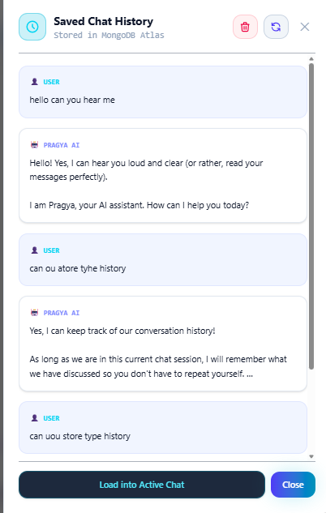
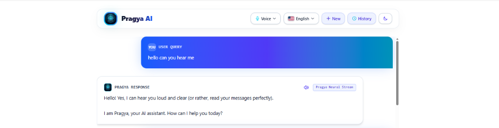
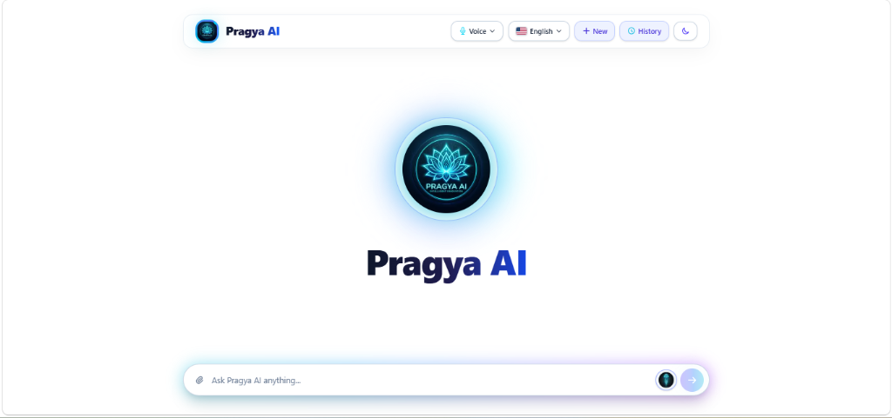

<div align="center">

# ⚡ Pragya AI (প্রজ্ঞা / প্রज्ञा) - Next-Gen Neural Voice & Document Assistant

<p align="center">
  A visually stunning, glassmorphic AI Assistant & Search Engine created by <b>Arpan Basak</b>. Powered by <b>Next.js 16</b>, <b>React 19</b>, <b>Tailwind CSS v4</b>, <b>MongoDB Atlas</b>, and <b>Google Gemini AI</b>.
</p>

<p align="center">
  <a href="https://my-ai-chatbot-ten-roan.vercel.app">
    
  </a>
  <a href="https://nextjs.org">
    
  </a>
  <a href="https://react.dev">
    
  </a>
  <a href="https://tailwindcss.com">
    
  </a>
  <a href="https://mongodb.com">
    
  </a>
  <a href="https://ai.google.dev/">
    
  </a>
</p>

</div>

---

## 👨‍💻 Creator & Inventor

**Pragya AI** was created, architected, and engineered by **Arpan Basak**, a Software Engineer and AI enthusiast from Kolkata, West Bengal, India.

---

## 🚀 Live Production URL

🔗 **[https://my-ai-chatbot-ten-roan.vercel.app](https://my-ai-chatbot-ten-roan.vercel.app)**

---

## 📸 Interface Showcase & Feature Walkthrough

### 1. 🏠 Main Futuristic AI Landing Dashboard
<div align="center">
  
</div>

#### Key Features Displayed:
- **Central Neon Lotus Portal**: Futuristic glowing branding element with dynamic ambient lighting effects.
- **Top Navigation Controls**:
  - 🎙️ **Voice Control Settings**: Switch between Male/Female neural voice synthesis modes.
  - 🌐 **Language Selector**: Choose preferred language (English, Bengali, Hindi, Spanish, French, etc.) with real national flag badges.
  - ➕ **+ New Chat**: Reset the active chat conversation state instantly.
  - 🕒 **History Button**: Access saved chat logs directly from MongoDB Cloud Atlas.
  - 🌙 **Dark/Light Mode Toggle**: Dynamic theme switching with glassmorphic backdrop filters.
- **Universal Input Dock**: Attachment button supporting document uploads (PDF, DOCX, PPTX, TXT, JSON, CSV), microphone input icon for Speech-to-Text listening, and send action trigger.

---

### 2. 💬 Real-Time Streaming Chat & Neural Voice Interface
<div align="center">
  
</div>

#### Key Features Displayed:
- **Vibrant User Query Bubbles**: Sleek gradient cards distinguishing user queries from AI responses.
- **Pragya Neural Stream**:
  - Real-time token streaming powered by Google Gemini AI with automatic multi-model fallback.
  - 🔊 **Voice Audio Playback**: Read-aloud button for listening to Pragya's response in natural text-to-speech.
  - ⚡ **Stream Status Indicator**: Visual notification badge ("Pragya Neural Stream") displaying active response generation status.

---

### 3. 💾 Saved Chat History Modal (MongoDB Cloud Integration)
<div align="center">
  
</div>

#### Key Features Displayed:
- **Cloud Database Synchronization**: Automatically fetches past chat logs stored securely in **MongoDB Atlas**.
- **Interactive Session Management**:
  - 🔄 **Refresh Button**: Fetch latest chat logs from backend API.
  - 🗑️ **Delete History Button**: Clear all stored chat history with confirmation.
  - 📥 **Load into Active Chat**: Restores past conversation messages straight into your main chat workspace for continuous multi-turn interaction.

---

## ✨ Detailed Application Features

### 🧠 1. Custom Pragya AI Persona & Multilingual Support
- Custom system prompt identifying **Arpan Basak** as creator.
- Multi-language fluency supporting English, Bengali (বাংলা), Hindi (हिंदी), and 25+ global languages.

### 🎙️ 2. Speech-to-Text & Text-to-Speech (STT / TTS)
- Hands-free voice commands using Web Speech API.
- Custom neural voice synthesis with configurable voice pitch and gender selection.

### 📄 3. Intelligent Document & File Parsing Engine
- Supports **PDF**, **DOCX**, **PPTX** (PowerPoint slides parser), **TXT**, **JSON**, and **CSV**.
- Extracted text is seamlessly passed to Gemini AI for document QA, summarization, and content extraction.

### 💾 4. MongoDB Atlas Persistence & History Management
- Persistent chat sessions stored in MongoDB Atlas cloud database.
- Serverless API endpoint `/api/chat` with GET, POST, and DELETE capabilities.

### ⚡ 5. Resilient Multi-Model Fallback Chain
- Automatic fallback hierarchy trying `gemini-3.5-flash` ➔ `gemini-3.5-flash-lite` ➔ `gemini-3.1-flash-lite` ➔ `gemini-flash-latest` ➔ `gemini-3.6-flash`.
- Eliminates single-model 429 quota blockages and 404 endpoint failures automatically.

---

## 🛠️ Tech Stack & Architecture

### 🌐 Frontend Layer
- **[Next.js 16 (App Router & Turbopack)](https://nextjs.org)**: Server-side rendering, dynamic API routes, and optimized bundle delivery.
- **[React 19](https://react.dev)**: Next-gen streaming components and UI state hooks.
- **[Tailwind CSS v4](https://tailwindcss.com)**: Glassmorphism utilities, custom gradient animations, and dark/light color tokens.

### ⚡ Backend & AI Stack
- **[Google Generative AI SDK (`@google/generative-ai`)](https://www.npmjs.com/package/@google/generative-ai)**: Streamed AI responses.
- **[MongoDB Atlas & Mongoose 9](https://mongoosejs.com)**: Scalable document database storage.
- **[Mammoth, PDF-Parse & JSZip](https://www.npmjs.com)**: Document text extraction parsers.

---

## 💻 Local Setup & Installation

1. **Clone the repository**:
   ```bash
   git clone https://github.com/arpanbasak90-cyber/my-ai-chatbot.git
   cd my-ai-chatbot
   ```

2. **Install dependencies**:
   ```bash
   npm install
   ```

3. **Configure Environment Variables**:
   Create a `.env.local` file in the root directory:
   ```env
   GEMINI_API_KEY=your_google_gemini_api_key
   MONGO_URI=your_mongodb_atlas_connection_string
   ```

4. **Run the development server**:
   ```bash
   npm run dev
   ```
   Open `http://localhost:3000` in your browser.

---

## 📄 License

Distributed under the MIT License.

<div align="center">
  <sub>Designed & Developed with ❤️ by <b>Arpan Basak</b>.</sub>
</div>
