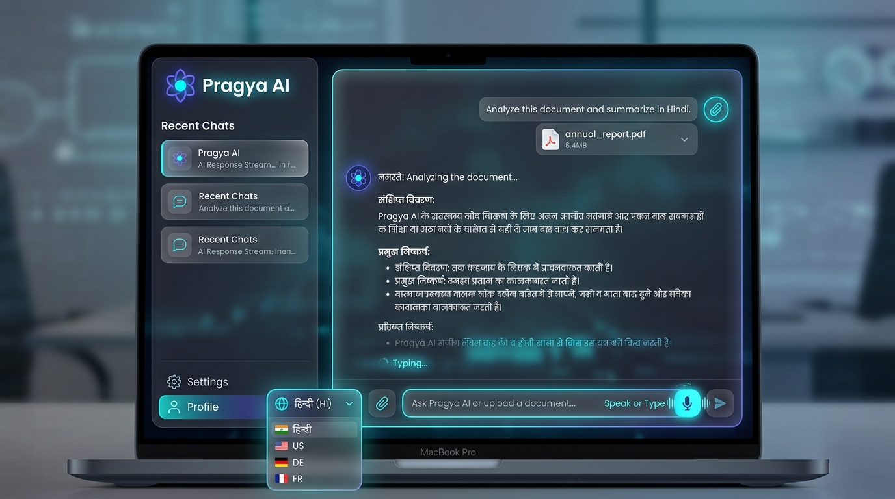

<div align="center">

# ⚡ Pragya AI (প্রজ্ঞা / प्रज्ञा) - Next-Gen Neural Voice & Document Assistant

<p align="center">
  A visually stunning, glassmorphic AI Assistant & Search Engine created by <b>Arpan Basak</b>. Powered by <b>Next.js 16</b>, <b>React 19</b>, <b>Tailwind CSS v4</b>, <b>MongoDB Atlas</b>, and <b>Google Gemini 3.6 Flash AI</b>.
</p>

<p align="center">
  <a href="https://my-ai-chatbot-ten-roan.vercel.app">
    
  </a>
  <a href="https://nextjs.org">
    
  </a>
  <a href="https://react.dev">
    
  </a>
  <a href="https://tailwindcss.com">
    
  </a>
  <a href="https://mongodb.com">
    
  </a>
  <a href="https://ai.google.dev/">
    
  </a>
</p>

</div>

---

## 📸 Frontend Showcase & User Interface

<div align="center">
  
</div>

---

## 👨‍💻 Creator & Inventor

**Pragya AI** was created and engineered by **Arpan Basak**.

---

## 🚀 Live Production URL

🔗 **[https://my-ai-chatbot-ten-roan.vercel.app](https://my-ai-chatbot-ten-roan.vercel.app)**

---

## ✨ Key Features & Highlights

- 🧠 **Pragya AI Core Intelligence**: Custom persona created by **Arpan Basak**, responding intelligently across English, Bengali, Hindi, and 25+ global languages.
- 🎙️ **Multilingual Voice Assistant (STT & TTS)**: Real-time Speech-to-Text voice listening and neural Text-to-Speech playback with customized voice tone selection (Male / Female).
- 📄 **Smart Document Analysis**: Upload and analyze PDF, DOCX, PPTX, TXT, JSON, and CSV documents directly inside the query bar.
- 💾 **MongoDB Atlas Chat History**: Persistent multi-turn chat history synced seamlessly with MongoDB Atlas database and instant local fallback.
- 📱 **100% Mobile Responsive Layout**: Precision-crafted UI with viewport scaling (`dvh`), top navigation wrapping, and touch-optimized popovers for phones, tablets, and desktop displays.
- 🎨 **Glassmorphic Aesthetic & Themes**: Ambient neon glow accents, backdrop blurs, dark mode, and high-contrast light mode with real national flag badges.
- 🔒 **Secure API Architecture**: Server-side secret key isolation guarding Gemini API keys and MongoDB connection credentials.

---

## 🛠️ Tech Stack & Architecture

### 🌐 Frontend Layer
- **[Next.js 16 (App Router & Turbopack)](https://nextjs.org)**: Server-side rendering, fast refresh, and optimized static asset generation.
- **[React 19](https://react.dev)**: Modern component state, streaming hooks, and asynchronous rendering.
- **[TypeScript 5](https://www.typescriptlang.org)**: End-to-end type safety across UI components and API handlers.
- **[Tailwind CSS v4](https://tailwindcss.com)**: Dynamic utility styling, custom glassmorphism panels (`glass-panel`), and neon glow effects.

### ⚡ Backend & AI Services
- **[Google Generative AI (`@google/generative-ai`)](https://www.npmjs.com/package/@google/generative-ai)**: Google Gemini 3.6 Flash integration powering real-time streamed responses.
- **[MongoDB & Mongoose](https://mongoosejs.com)**: Cloud database persistence for user chat logs and history retrieval.
- **[Mammoth & PDF-Parse](https://www.npmjs.com)**: File stream parsers extracting content from `.docx`, `.pdf`, `.pptx`, and text files.

---

## 💻 Local Setup & Installation

1. **Clone the repository**:
   ```bash
   git clone https://github.com/arpanbasak90-cyber/my-ai-chatbot.git
   cd my-ai-chatbot
   ```

2. **Install dependencies**:
   ```bash
   npm install
   ```

3. **Configure Environment Variables**:
   Create a `.env.local` file in the root directory:
   ```env
   GEMINI_API_KEY=your_google_gemini_api_key
   MONGO_URI=your_mongodb_atlas_connection_string
   ```

4. **Run the development server**:
   ```bash
   npm run dev
   ```
   Open `http://localhost:3000` in your browser.

---

## 📄 License

Distributed under the MIT License.

<div align="center">
  <sub>Designed & Developed with ❤️ by <b>Arpan Basak</b>.</sub>
</div>
